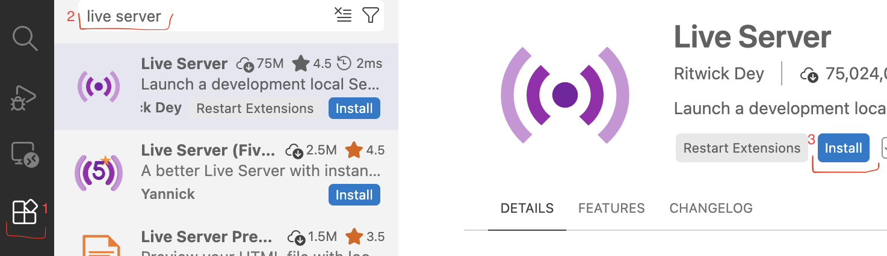

Кузнецов Станислав Андреевич​
# Знакомство с HTML

## Что такое HTML
HTML — язык разметки для создания структуры веб-страницы и представления контента. Благодаря разметке браузер знает в каком порядке отображать элементы, и что они значат.​

## Инструменты

* VS Code - https://code.visualstudio.com/Download​

* Live Server (расширение VS Code):​

    1. Открыть Extentions Marketplace, нажав на значок Extentions​

    2. Найти расширение Live Server, написав Live Server в строке поиска​

    3. Установить расширение, нажав Install​



## Структура документа HTML​

Любой HTML документ состоит из **тегов**. Тег начинается с ```<``` и заканчивается на ```>```. Большинство тегов имеет **закрывающий тег**. Закрывающий тег начинается с ```</``` и заканчивается на ```>```.

**Например**, тег ```<html>``` и закрывающий его тег ```</html>```:

```html
<html>
   ... 
</html>
```
Вместо трех точек должно быть **содержимое** тега. Все, что мы напишем между открывающим и закрывающим тегом, будет являтся **содержимым** тега.

**Например**, тег ```<head>``` находится внутри тега ```<html>``` и является его содержимым:

```html
<html>
  <head>
    ...
  </head>
</html>
```

У тегов есть **атрибуты**. Атрибут - это специальное слово внутри открывающего тега, которое задает дополнительные параметры, свойства или поведение элемента. Пишутся только в открывающем теге. 

**Например**, атрибут ```lang="ru"``` в теге ```<html>```:

```html
<html lang="ru">
  ...
</html>
```

### Пример структуры HTML документа

```html
<!DOCTYPE html>
<html lang="ru">
  <head>
    ...
  </head>
  <body>
    ...
  </body>
</html>
```

### Разберем по частям:


1. ```<!DOCTYPE>``` или «доктайп» — это сокращение от «тип документа» (document type). Доктайп говорит браузеру: «работай со страницей в стандартном режиме, пожалуйста». Единственный доктайп, который вам нужно знать — это ```<!DOCTYPE html>```. Поставьте его первой строчкой HTML-документа, и браузер обработает страницу правильно.

2. Тег ```<html>``` открывает контейнер, в котором находится всё содержимое страницы. Это корневой, или родительский, элемент всего документа.

3. Внутри тега ```<html>``` находится тег ```<head>``` со своим закрывающим тегом ```</head>```.

4. Также, внутри тега ```<html>``` находится тег ```<body>``` со своим закрывающим тегом ```</body>```.

5. Закрывающий тег ```</html>```. Является последним тегом в документе. 

## Тег ```<head>```

Элемент ```<head>``` содержит основную информацию о документе: метаданные (например, заголовок окна или кодировку), ссылки на скрипты и таблицы стилей.

Эта информация не отображается на странице браузера. Пользователи увидят только заголовок окна страницы — его задаёт тег ```<title>```, ну и фавиконку, если вы её поставите.

### Пример
```html
<html lang="ru">
  <head>
    <title>Заголовок страницы</title>
  </head>
</html>
```

Имеет абрибут ```lang```, который указывает на язык документа.

Кроме ```<title>```, внутри контейнера ```<head>``` можно разместить и другие элементы: ```<link>```, ```<meta>```, ```<script>```, ```<style>```, ```<template>```, ```<noscript>```.

## Тег ```<link>```
Позволяет загружать на страницу содержимое из внешнего файла.

### Пример
```html
<head>
  <link href="style.css" rel="stylesheet">
</head>
```

### Атрибуты

* ```href``` — URL-ссылка на внешний файл.

* ```rel``` — говорит браузеру, какую роль играет ссылка внутри тега. Иными словами, этот атрибут выражает отношения между вашей страницей и файлом, на который ведёт ссылка. Самое часто встречающееся значение — ```rel="stylesheet"```, оно означает, что ссылка внутри <link> ведёт на внешний файл с CSS-стилями. А для добавления фавиконки используется ```rel="icon"```.

* ```sizes``` — устанавливает размер — ширину и высоту — фавиконки в пикселях, например ```sizes="114x114"```. А если написать ```sizes="any"```, то браузер сможет масштабировать иконку под любой размер. Так можно делать с иконками в векторном формате, например SVG.

## Тег ```<meta>```

В теге ```<meta>``` хранится краткое описание страницы, ключевые слова и другие данные, которые могут понадобиться браузерам и поисковым системам.

Таких метатегов может быть любое количество. Все они размещаются внутри тега ```<head>```, желательно в самом начале.

### Пример
```html
<head>
  <meta name="description" content="Краткое описание страницы">
  <meta
    name="keywords"
    content="ключевое слово 1, ключевое слово 2, ключевое слово 3"
  >
  <meta name="viewport" content="width=device-width, initial-scale=1.0">
</head>
```

### Атрибуты

* ```charset``` - задаёт кодировку страницы. Рекомендуется писать здесь UTF-8 — это самый распространённый вариант.

    ```html
    <meta charset="UTF-8">
    ```

* ```content``` - основное содержимое метатега.

* ```name``` - имя метатега, которое также определяет его значение. Используется в паре с ```content```. Можно задать следующие значения:

    * ```"keywords"``` — ключевые слова, которые помогают поисковикам находить страницу в интернете. По сути, это самые важные слова из содержания страницы.
        ```html
        <meta name="keywords" content="Рецепт, печенье, готовим дома">
        ```

    * ```"viewport"``` — задаёт параметры окна просмотра в браузере. Страницу можно сделать адаптивной, подогнав ширину окна под размеры устройства. В примере ниже ```width``` указывает ширину окна просмотра, а ```initial-scale``` — коэффициент масштабирования страницы при первом открытии:

        ```html
        <meta
        name="viewport"
        content="width=device-width, initial-scale=1.0, maximum-scale=2.0, user-scalable=yes"
        >
        ```

    * ```"description"``` — краткое описание страницы, которое видит пользователь, когда находит сайт в поисковике. Например: «Рассказываем, как нарезать картошку тонкими ломтиками» для сайта о кулинарии. Это описание помогает поисковикам найти страницу, а пользователю — узнать, о чём она. Так что не забывайте указывать ```"description"```.
        ```html
        <meta
        name="description"
        content="Рассказываем, как нарезать картошку тонкими ломтиками"
        >
        ```

    * ```"author"``` — имя автора страницы.
        ```html
        <meta name="author" content="Иван Петров">
        ``` 

## Тег ```<style>```

Внутри тега ```<style>``` можно задать параметры для CSS-стилей, которые применяются на странице. В общем, тут ты описываешь, как будут выглядеть заголовки, ссылки, обычный текст и другие элементы страницы.

На практике лучше использовать подключение отдельных CSS-файлов с помощью тега ```<link>```.

### Пример

```html
<!DOCTYPE html>
<html lang="ru">
  <head>
    <style>
      p {
        color: red;
      }
    </style>
  </head>
  <body>
    <p>This is my paragraph.</p>
  </body>
</html>
```

## Тег ```<script>```

Скрипт — это элемент кода, который позволяет совершать действия, включать анимацию и создавать другие эффекты на странице. Чтобы добавить скрипты, используй тег ```<script>```.

Как и CSS-стили, скрипты можно прописать внутри кода страницы, либо добавить как внешний документ по ссылке.

Рекомендуется добавлять их в самый конец перед закрывающим тегом ```</body>```.

### Пример

В этом примере мы подключим скрипты из внешнего файла с расширением ```.js```. Лучше делать именно так, вместо того, чтобы прописывать код скрипта в структуре страницы. Атрибут ```src``` указывает путь к файлу.

```html
<script src="external.js"></script>
```

# Задание

1. Установить VS Code

2. Установить расширение Live Server

3. Создать папку проекта, в котором будете заниматься

4. Создать в папке HTML файл ```index.html```

5. Добавить в файл ```index.html``` основную структуру HTML документа включая ```<DOCTYPE>```, ```<html>``` и ```<head>```. У тега ```<html>``` Не забыть указать атрибут ```lang```.

6. Внутри тега ```<head>``` прописать тег ```<title>```, указать названием страницы свое ФИО, прописать тег ```<meta>``` с кодировкой страницы (```UTF-8```).

7. *Внутри тега ```<head>``` прописать тег ```<link>``` для подключения фавиконки.

8. Запустить Live Server и проверить работоспособность
