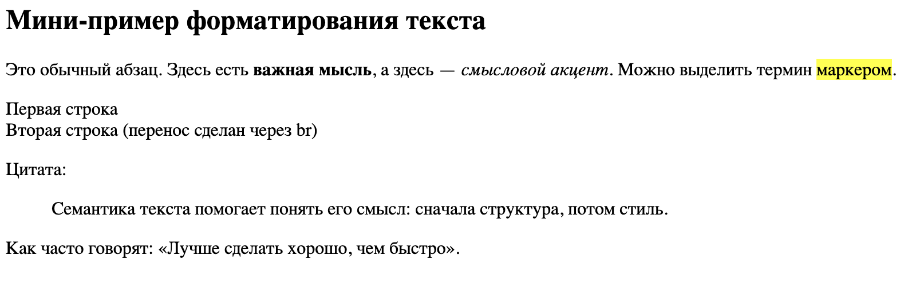
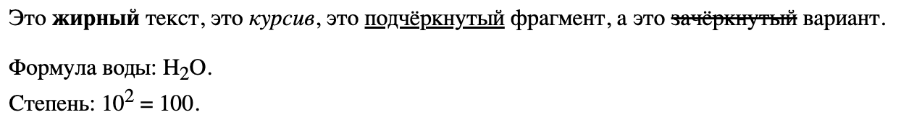
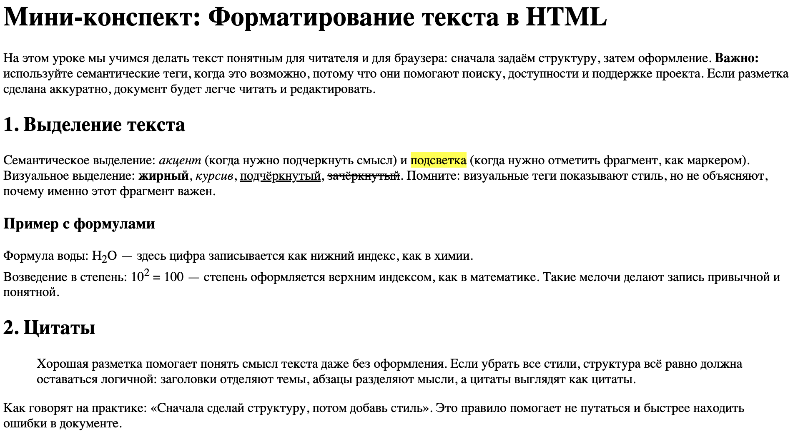

Кузнецов Станислав Андреевич
# Тело HTML-документа. Тег BODY. Работа с текстом.

### Cтруктура HTML документа
```html
<html>
  <head>
    ...
  </head>
  <body>
    ...
  </body>
</html>
```

## Тег ```<body>```

Элемент ```<body>``` содержит весь контент, который появится на странице: текст, изображения, теги, скрипты JavaScript и так далее.

В вашем документе может быть только один ```<body>```.

Элемент ```<body>``` ставят сразу после закрывающего ```</head>```.

## Структурное и физическое форматирование текста

Структурное — описывает значение текста (важность, цитата, заголовок, код и т.д.).

Физическое — описывает внешний вид (жирный/курсив и т.п.).

## Теги структурного форматирования текста

* ```<p>``` — абзац

* ```<h1>```, ```<h2>```, ```<h3>```, ```<h4>```, ```<h5>```, ```<h6>``` — заголовки
* ```<br>``` — перенос строки
* ```<strong>``` — логически важный фрагмент
* ```<em>``` — смысловое выделение
* ```<mark>``` — подсветка
* ```<blockquote>``` — блочная цитата
* ```<q>``` — короткая цитата внутри строки


### Пример
```html
<h2>Мини-пример форматирования текста</h2>

<p>
  Это обычный абзац. Здесь есть <strong>важная мысль</strong>,
  а здесь — <em>смысловой акцент</em>. Можно выделить термин
  <mark>маркером</mark>.
</p>

<p>
  Первая строка<br>
  Вторая строка (перенос сделан через br)
</p>

<blockquote>
  Семантика текста помогает понять его смысл: сначала структура, потом стиль.
</blockquote>

<p>
  Как часто говорят: <q>Лучше сделать хорошо, чем быстро</q>.
</p>
```



## Теги физического форматирования текста

* ```<b>``` — выделение текста жирным

* ```<i>``` — выделение текста курсивом
* ```<u>``` — выделение текста подчёркиванием
* ```<s>``` — выделение текста зачёркиванием
* ```<sub>``` — перевод текста в нижний индекс
* ```<sup>``` — перевод текста в верхний индекс

### Пример
```html
<p>
  Это <b>жирный</b> текст, это <i>курсив</i>, это <u>подчёркнутый</u> фрагмент,
  а это <s>зачёркнутый</s> вариант.
</p>

<p>
  Формула воды: H<sub>2</sub>O.<br>
  Степень: 10<sup>2</sup> = 100.
</p>
```



## Глобальные атрибуты

Существует категория HTML-атрибутов, которые можно применить к любому или почти любому HTML-тегу.

### ```class```

Позволяет выбирать конкретный элемент (или несколько) при помощи CSS или JavaScript. В качестве значения для атрибута ```class``` задают один или несколько классов для HTML-элемента, разделённые пробелом.

### ```id```

Важно, чтобы значение идентификатора было уникальным в рамках одной страницы. Позволяет создавать якоря — ссылки на части страницы, выбирать уникальный элемент при помощи CSS или JavaScript. Значение: одно слово или набор символов, не может содержать пробелы. Позволяет сделать один из элементов на странице уникальным.

## ```hidden```

```hidden``` не требует явного указания значения, наличие атрибута само по себе означает состояние ```true```. Прячет со страницы любой HTML-элемент. Причём элемент невидим не только для глаз пользователя, но и для скринридеров.

## ```lang```

Определяет, на каком языке написан текст внутри элемента, для которого задан этот атрибут. Удобно, если в вашем тексте есть цитаты или выдержки из документа на другом языке. Подстраивает пунктуацию и оформление под стандарты указанного языка.

# Задание:

1. В документ из прошлого занятия добавить текст внутрь тега ```<body>``` по формату:

    

    Текст:

Мини-конспект: Форматирование текста в HTML
На этом уроке мы учимся делать текст понятным для читателя и для браузера: сначала задаём структуру, затем оформление. Важно: используйте семантические теги, когда это возможно, потому что они помогают поиску, доступности и поддержке проекта. Если разметка сделана аккуратно, документ будет легче читать и редактировать.

Выделение текста
Семантическое выделение: акцент (когда нужно подчеркнуть смысл) и подсветка (когда нужно отметить фрагмент, как маркером).
Визуальное выделение: жирный, курсив, подчёркнутый, зачёркнутый. Помните: визуальные теги показывают стиль, но не объясняют, почему именно этот фрагмент важен.

Пример с формулами
Формула воды: H2O — здесь цифра записывается как нижний индекс, как в химии.
Возведение в степень: 10^2 = 100 — степень оформляется верхним индексом, как в математике. Такие мелочи делают запись привычной и понятной.

Цитаты
Хорошая разметка помогает понять смысл текста даже без оформления. Если убрать все стили, структура всё равно должна оставаться логичной: заголовки отделяют темы, абзацы разделяют мысли, а цитаты выглядят как цитаты.

Как говорят на практике: “Сначала сделай структуру, потом добавь стиль”. Это правило помогает не путаться и быстрее находить ошибки в документе.

2. Запустить Live Server и проверить соответствие формату
