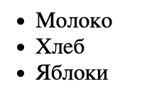
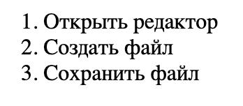
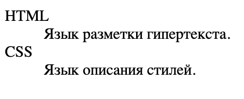
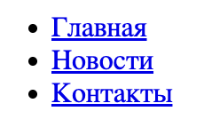
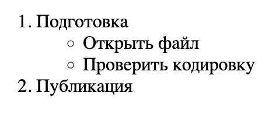
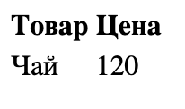
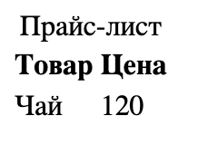
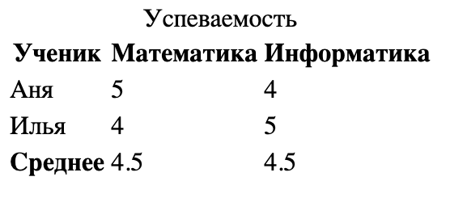
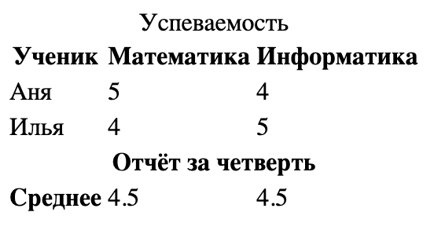
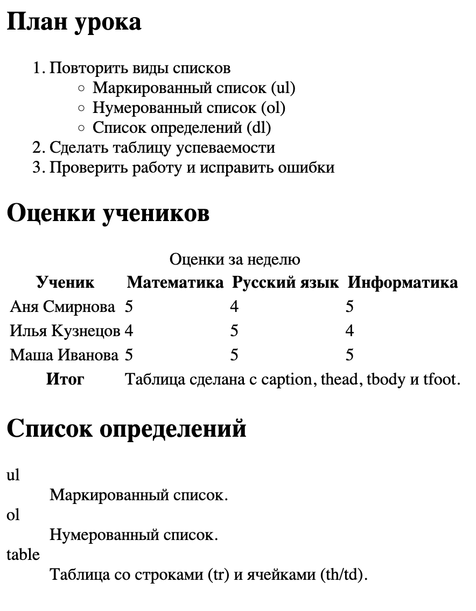

Кузнецов Станислав Андреевич
# Списки. Таблицы.

Разберем виды списков и когда они используются.

## Неупорядоченный (маркированный) список — ```<ul>```

Используется, когда порядок пунктов не важен.

```<li>``` - пункт списка.

### Пример
```html
<ul>
  <li>Молоко</li>
  <li>Хлеб</li>
  <li>Яблоки</li>
</ul>
```



## Упорядоченный (нумерованный) список - ```<ol>```

Используется, когда важен порядок.

### Пример
```html
<ol>
  <li>Открыть редактор</li>
  <li>Создать файл</li>
  <li>Сохранить файл</li>
</ol>
```



### Полезные атрибуты ```<ol>```

* ```start``` — начать нумерацию с произвольной цифры

* ```reversed``` — нумерация в обратном порядке
* ```type="1|A|a|I|i"``` — тип нумерации

## Список определений — ```<dl>```

Подходит для терминов и их объяснений: термин (```<dt>```) и определение (```<dd>```).

### Пример
```html
<dl>
  <dt>HTML</dt>
  <dd>Язык разметки гипертекста.</dd>

  <dt>CSS</dt>
  <dd>Язык описания стилей.</dd>
</dl>
```



## Список меню — ```<menu>```

В HTML5 ```<menu>``` можно использовать как список команд/пунктов меню. На практике часто используют ```<ul>``` для навигации, но ```<menu>``` тоже допустим.

### Пример
```html
<menu>
  <li><a href="#home">Главная</a></li>
  <li><a href="#news">Новости</a></li>
  <li><a href="#contacts">Контакты</a></li>
</menu>
```



## Комбинирование (вложенность) списков

Один список можно вкладывать в другой

### Пример
```html
<ol>
  <li>Подготовка
    <ul>
      <li>Открыть файл</li>
      <li>Проверить кодировку</li>
    </ul>
  </li>
  <li>Публикация</li>
</ol>
```



## Базовая таблица: строки и ячейки

* ```<table>``` — таблица

* ```<tr>``` — строка
* ```<td>``` — обычная ячейка
* ```<th>``` — заголовочная ячейка

### Пример
```html
<table>
  <tr>
    <th>Товар</th>
    <th>Цена</th>
  </tr>
  <tr>
    <td>Чай</td>
    <td>120</td>
  </tr>
</table>
```



## Добавляем название таблицы — ```<caption>```

```<caption>``` должен быть первым дочерним элементом внутри ```<table>```.

### Пример
```html
<table>
  <caption>Прайс-лист</caption>
  <tr>
    <th>Товар</th>
    <th>Цена</th>
  </tr>
  <tr>
    <td>Чай</td>
    <td>120</td>
  </tr>
</table>
```



## Структурное форматирование таблицы (семантические секции)

* ```<thead>``` — шапка таблицы
* ```<tbody>``` — основная часть
* ```<tfoot>``` — подвал (итоги)

### Пример

```html
<table>
  <caption>Успеваемость</caption>

  <thead>
    <tr>
      <th>Ученик</th>
      <th>Математика</th>
      <th>Информатика</th>
    </tr>
  </thead>

  <tbody>
    <tr>
      <td>Аня</td>
      <td>5</td>
      <td>4</td>
    </tr>
    <tr>
      <td>Илья</td>
      <td>4</td>
      <td>5</td>
    </tr>
  </tbody>

  <tfoot>
    <tr>
      <th>Среднее</th>
      <td>4.5</td>
      <td>4.5</td>
    </tr>
  </tfoot>
</table>
```

 

## Объединение ячеек — ```colspan``` и ```rowspan```

```colspan``` — объединение по столбцам

```rowspan``` — объединение по строкам

### Пример

```html
table>
  <caption>Успеваемость</caption>

  <thead>
    <tr>
      <th>Ученик</th>
      <th>Математика</th>
      <th>Информатика</th>
    </tr>
  </thead>

  <tbody>
    <tr>
      <td>Аня</td>
      <td>5</td>
      <td>4</td>
    </tr>
    <tr>
      <td>Илья</td>
      <td>4</td>
      <td>5</td>
    </tr>
  </tbody>

  <tfoot>
    <tr>
      <th colspan="3">Отчёт за четверть</th>
    </tr>
    <tr>
      <th>Среднее</th>
      <td>4.5</td>
      <td>4.5</td>
    </tr>

  </tfoot>
</table>
```

 

# Задание:

1. Сделать HTML документ по формату:

   

2. Запустить Live Server и проверить соответствие формату
